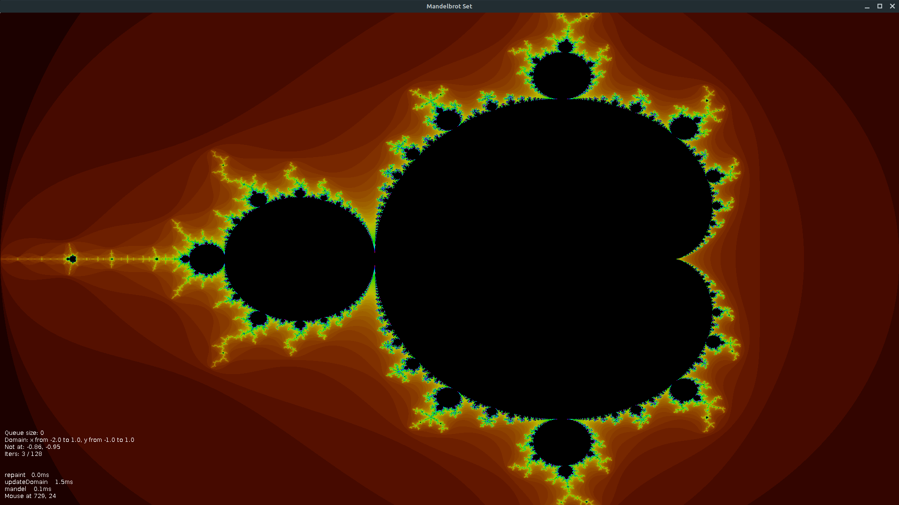

# Mandelbrot Set

### Interactive visualisation of the Mandelbrot set.

The [Mandelbrot set](https://en.wikipedia.org/wiki/Mandelbrot_set) is the set of
complex numbers C for which the function f(z) = z**2 + c, starting with z = 0, 
does not diverge.

Note that to be in the set, an infinite amount of interactions is required for each point,
therefore a `maxIters` is set and if the sequence does not diverge within that limit, 
interaction stops. Hence small value of interaction means that the point diverged quickly.
The more iteractions, be longer it took to diverge. Points that reached `maxIters` interactions
did not diverge.

The image represents a complex plane and the color space is calculated from the number of 
iterations for each point, from red to violet as that number increases and black if `maxIters` is reached.

# Use

Drag the mouse to draw a rectangle. The selected region is zommed in upon release the mouse.

Note that the calculation of a frame can take some time. Progress can be seem by the queue size.

## Keys

  * up   increase maxiters by a factor of 2
  * down decrease maxiters by a factor of 4
  * b    back to previous zoom level
  * r    force repaint (obsolete)

# TODO

 - [ ] Improve color map 

 - [ ] Increase precision

 - [ ]Optional input of numThreads. For now hard coded to 64.

 - [ ] Optional input of resolution. For now hard coded to 1920 x 1080 pixels.

# Download 

Get the JAR file under [Actions](https://github.com/haphaeu/MandelbrotSet/actions)

# Project Status

